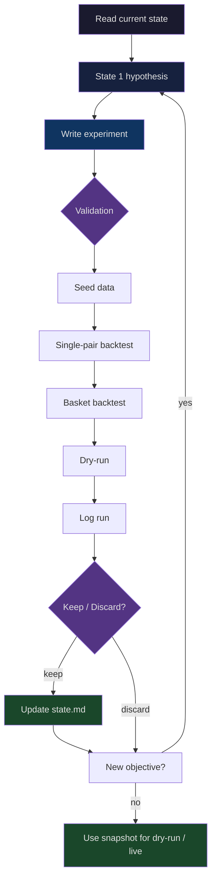

# Bot Trade

Crypto trading bot built on Freqtrade.

## Current focus

- strategy: `src/strategies/SMC_FVG_Context30m_Freqtrade.py`
- config: `config/config.futures.json`
- research: `.research/smc_fvg_pinbar/README.md`

## Default strategy

`SMC_FVG_Context30m_Freqtrade` is a hybrid:

- execution timeframe: `30m`
- context timeframe: `1h`
- base logic: uses `1h` signal as primary context, maps it to the two corresponding `30m` candles for entry
- extra short edge: allows `30m displacement short` when `1h close < EMA20` and `1h EMA20 slope < 0`

In short: `1h` determines bias, `30m` executes earlier. This is the current default baseline.

## Research flow



## Trace model


## Quick Start

```bash
uv sync
uv run python -m scripts.seed_freqtrade_data --config config/config.futures.json \
  --preset smc-basket --dataset snapshots/accepted_6pair_2026q3 \
  --timerange 20251019-20260517
set -a
source .env
set +a

make validate-snapshot DATASET=accepted_6pair_2026q3 \
  VALIDATION_START=2025-10-19 VALIDATION_END=2026-05-17
```

Start dry-run only with the `PASS` manifest from validation:

```bash
make dry-run VALIDATION_MANIFEST=.research/smc_fvg_pinbar/runs/<run-id>/manifest.json
```

A `WARN`, `FAIL`, missing manifest, changed config/policy/strategy dependency,
basket mismatch, or config without `dry_run: true` blocks dry-run before
Freqtrade starts.
`WARN` and `FAIL` retain their manifest and Freqtrade exports in
`.research/smc_fvg_pinbar/runs/`; create a new hypothesis instead of changing
thresholds in the same loop.

Compose option:

```bash
docker compose up -d freqtrade-demo
docker compose up -d freqtrade-live
```

## Seed data

The seed script calls `freqtrade download-data` directly.
Active data is saved in the format declared in config:

- `datadir = user_data/data`
- `dataformat_ohlcv = feather`
- `trading_mode = futures`

Layout:

- dataset active: `user_data/data/binance/futures`
- dataset snapshot: `user_data/data/snapshots/<name>/futures`

Make targets:

- `make seed DAYS=90`
- `make seed-range TIMERANGE=20260218-20260518`
- `make seed-snapshot DATASET=recent_selected DAYS=30`
- `make list-data`
- `make list-snapshot DATASET=recent_selected`
- `make backtest TIMERANGE=20260218-20260518`
- `make backtest-snapshot DATASET=recent_selected TIMERANGE=20260218-20260518`
- `make validate-snapshot DATASET=accepted_6pair_2026q3`
- `make validate-pass VALIDATION_MANIFEST=.research/smc_fvg_pinbar/runs/<run-id>/manifest.json`
- `make monitor-decay BASELINE=user_data/backtest_results/baseline.zip DB=user_data/tradesv3.demo.sqlite`
- `make plot`
- `make plot-df PAIR=BTC/USDT:USDT`
- `make dry-run VALIDATION_MANIFEST=.research/smc_fvg_pinbar/runs/<run-id>/manifest.json`
- `make demo`
- `make live`

Examples:

```bash
uv run python -m scripts.seed_freqtrade_data --preset smc-basket --days 90
uv run python -m scripts.seed_freqtrade_data --pairs BTC/USDT:USDT ETH/USDT:USDT --days 30
uv run python -m scripts.seed_freqtrade_data --preset smc-basket --timerange 20250101-20250301
uv run python -m scripts.seed_freqtrade_data --preset smc-basket --dataset snapshots/recent_selected --days 30
```

Default futures basket:

- `PLAY/USDT:USDT`
- `BIO/USDT:USDT`
- `SPACE/USDT:USDT`
- `PENDLE/USDT:USDT`
- `BR/USDT:USDT`
- `YGG/USDT:USDT`

## Dry-run validation gate

Seed the named accepted six-pair snapshot with `1m`, `30m`, and `1h` data,
then provide an approved identity manifest and validation window. The gate
itself requires the frozen policy's OOS folds:

```bash
make validate-snapshot DATASET=accepted_6pair_2026q3 \
  VALIDATION_START=2025-10-19 VALIDATION_END=2026-05-17 \
  APPROVED_IDENTITY=.research/smc_fvg_pinbar/approved-baseline-identity.json
```

The command uses `config/config.futures.json`, the named snapshot datadir,
`config/validation.baseline.json`, `SMC_FVG_Context30m_Freqtrade`,
`src/strategies`, and `.research/smc_fvg_pinbar/runs/`. Only a `PASS` verdict
allows `make dry-run`. `WARN` and `FAIL` keep the validation artifacts and
block dry-run; record a new hypothesis before rerunning, without changing
thresholds in that loop. No named snapshot has been validated yet.

Pass the resulting manifest explicitly when starting dry-run:

```bash
make dry-run VALIDATION_MANIFEST=.research/smc_fvg_pinbar/runs/<run-id>/manifest.json
```

`make dry-run` re-hashes the effective config, policy, strategy and its local
dependencies (including `SMC_FVG_Confirmation_Freqtrade.py`), verifies the
accepted basket and `dry_run: true`, and rejects any mismatch before it runs
Freqtrade.

Monitor closed demo or live trades against a retained baseline export:

```bash
make monitor-decay BASELINE=user_data/backtest_results/baseline.zip \\
  DB=user_data/tradesv3.demo.sqlite
```
