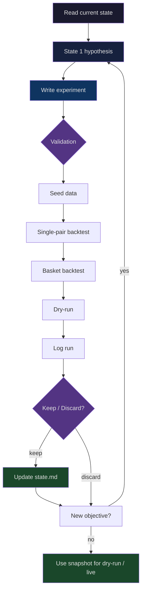

# Bot Trade

Crypto trading bot built on Freqtrade.

## Current focus

- strategy: `src/strategies/SMC_FVG_Context30m_Freqtrade.py`
- config: `config/config.futures.json`
- research: `.research/smc_fvg_pinbar/README.md`

## Default strategy

`SMC_FVG_Context30m_Freqtrade` is a hybrid:

- execution timeframe: `30m`
- context timeframe: `1h`
- base logic: uses `1h` signal as primary context, maps it to the two corresponding `30m` candles for entry
- extra short edge: allows `30m displacement short` when `1h close < EMA20` and `1h EMA20 slope < 0`

In short: `1h` determines bias, `30m` executes earlier. This is the current default baseline.

## Research flow



## Trace model


## Quick Start

```bash
uv sync
uv run python scripts/seed_freqtrade_data.py --preset smc-basket --days 90
set -a
source .env
set +a

make dry-run
```

Compose option:

```bash
docker compose up -d freqtrade-demo
docker compose up -d freqtrade-live
```

## Seed data

The seed script calls `freqtrade download-data` directly.
Active data is saved in the format declared in config:

- `datadir = user_data/data`
- `dataformat_ohlcv = feather`
- `trading_mode = futures`

Layout:

- dataset active: `user_data/data/binance/futures`
- dataset snapshot: `user_data/data/snapshots/<name>/futures`

Make targets:

- `make seed DAYS=90`
- `make seed-range TIMERANGE=20260218-20260518`
- `make seed-snapshot DATASET=recent_selected DAYS=30`
- `make list-data`
- `make list-snapshot DATASET=recent_selected`
- `make backtest TIMERANGE=20260218-20260518`
- `make backtest-snapshot DATASET=recent_selected TIMERANGE=20260218-20260518`
- `make plot`
- `make plot-df PAIR=BTC/USDT:USDT`
- `make dry-run`
- `make demo`
- `make live`

Examples:

```bash
uv run python scripts/seed_freqtrade_data.py --preset smc-basket --days 90
uv run python scripts/seed_freqtrade_data.py --pairs BTC/USDT:USDT ETH/USDT:USDT --days 30
uv run python scripts/seed_freqtrade_data.py --preset smc-basket --timerange 20250101-20250301
uv run python scripts/seed_freqtrade_data.py --preset smc-basket --dataset snapshots/recent_selected --days 30
```

Default futures basket:

- `PLAY/USDT:USDT`
- `BIO/USDT:USDT`
- `SPACE/USDT:USDT`
- `PENDLE/USDT:USDT`
- `BR/USDT:USDT`
- `YGG/USDT:USDT`
